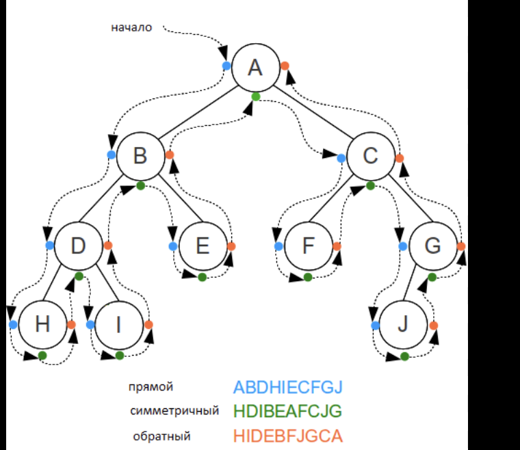

## Структура данных «Дерево». Обход деревьев.

1) **Прямой обход** обычно относится к базовому способу обхода дерева или графа, где мы начинаем с определенной вершины и посещаем все ее непосещенные соседи, прежде чем переходить к следующей вершине. Это может быть как обход в `глубину (DFS)`, так и обход в `ширину (BFS)`, в зависимости от того, какой порядок посещения вершин предпочтительнее в данном случае.
   * Посещение корневого узла
   * Рекурсивный обход левого поддерева
   * Рекурсивный обход правого поддерева

2) **Симметричный обход.** При симметричном обходе мы проходим по пути к самому левому потомку, затем возвращаемся к корню, посещаем его и следуем к правому потомку.
   * Рекурсивный обход левого поддерева
   * Посещение корневого узла
   * Рекурсивный обход правого поддерева
   
3) **Обратный обход.** При обратном подходе мы сначала посещаем левого потомка, затем правого и по завершении обхода поддеревьев считываем корень. (Листья считаем сразу, узлы если два раза коснулись)
   * Рекурсивный обход левого поддерева
   * Рекурсивный обход правого поддерева
   * Посещение корневого узла
   
