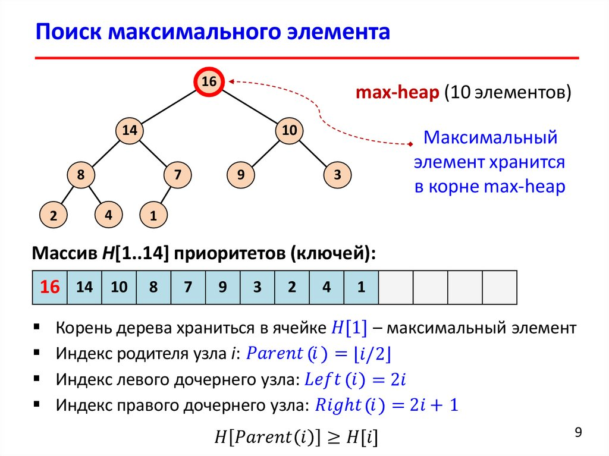

# Бинарная куча. Абстракция «Очередь с приоритетом».

## Определения

**Куча (англ. heap)** - одна из простейших структур данных, основанных на деревьях. Куча используется для поддержания некоторого множества элементов с возможностью быстрого нахождения максимума (или минимума, это не принципиально).

**Бинарная куча** - это бинарное дерево, удовлетворяющее условиям:
1) Для любой вершины ее приоритет не меньше приоритета потомка.
2) Дерево является правильным подмножеством полного бинарного, допускающее плотное хранение узлов в массиве.
**Бинарная куча = пирамида**

Поддерживаются операции:
* Добавить элемент (Сложность: O(logN))
* Найти максимум (Сложность: O(1))
* Удалить максимальный элемент (Сложность: O(logN))

Элементы в куче хранятся в виде полного бинарного дерева. Главное его свойство (инвариант кучи) формулируется следующим образом:

> Элемент в каждой вершине больше либо равен элементов во всех дочерних вершинах. Максимальный элемент всегда будет находиться в корне дерева.

**При добавлении в кучу нового элемента,** ему присваивается первый доступный индекс. То есть, бинарное дерево заполняется по уровням слева направо. После добавления элемента возможно, что инвариант кучи перестанет выполняться, так как новый элемент будет больше своего прямого предка. В таких случаях просто меняем элемент местами с прямым предком. Если инвариант кучи всё ещё не выполняется, меняем его местами с новым предком, и так далее, пока куча не нормализуется. Такая операция называется **проталкиванием вверх**.

**При извлечении максимального элемента** воспользуемся следующей хитростью: переместим последний элемент в куче (крайний правый на последнем уровне) в корень дерева на место удалённого максимума. Это почти наверняка нарушит инвариант, так как новый “максимум” будет меньше элементов в дочерних вершинах. Сравним два дочерних элемента, выберем из них больший, и поменяем его местами с текущим “максимумом”. Повторяем эту операцию, пока инвариант не восстановится. Это называется **проталкиванием вниз**.

**Очередь с приоритетом** - абстрактная структура данных, позволяющая поддерживать множество элементов, находить и извлекать минимум из него, тогда как куча - конкретная структура данных, основанная на полном бинарном дереве.

