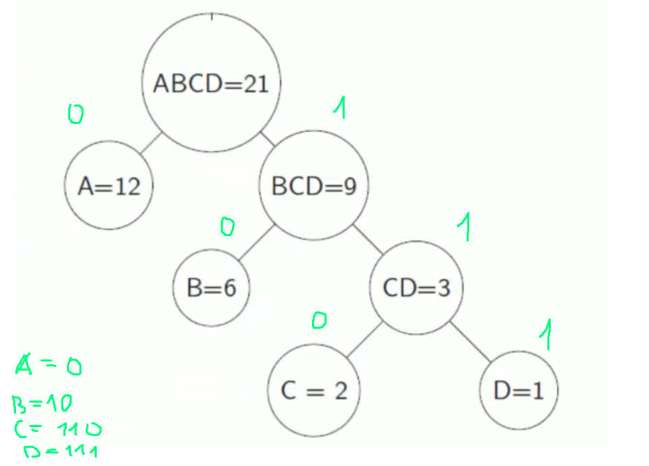

## Двоичные деревья. Алгоритм Хаффмана.

**Задача:** найти минимальный префиксный код для множества.(префиксный означает что никакой символ не является префиксом другого символа при кодировании)

Пусть имеется текст, состоящий из множества 4 символов: AAAAAAAAAAAABBBBBBCCD

Его длина 21 символов. Текст можно закодировать следующим образом:

(A -> 00),(B -> 01),(C -> 10),(D -> 11)

Для простоты и наглядности разместим наш алфавит в виде двоичного дерева

`Для кодирования каждого символа понадобится 2 бита и длина кода составит 42 бит.`

**Алгоритм Хаффмана** -  алгоритм оптимального префиксного кодирования алфавита. Его идея состоит в подсчёта частоты вхождения каждого элемента во множестве. Чем чаще встречается элемент тем меньше он должен весить.

**Алгоритм**:
1. помещаем в каждый узел частоту символа
2. располагаем узлы в порядке убывания
3. для 2 наименьших добавляем узел, который их соединяет
4. его значение cоотвествует сумме частот его детей
5. повторяем с п.3

Вернемся к примеру:  AAAAAAAAAAAABBBBBBCCD
Вычисляем частоты вхождений:
F(a) = 12; F(b) = 6; F(c) = 2; F(d) = 1;

Ход решения:
1. выбираем 2 узла с наименьшей частотой(С и D), помещаем их на 1 уровень, соединяем с родителем CD=3
2. Повторяем п.1, но уже для множества A=12, B=6, CD=3
 

Ответом для данного набора является 

`A => 0; B => 10; C => 110; D => 111`

**Общая длина составит 33 бита что < 42.**

