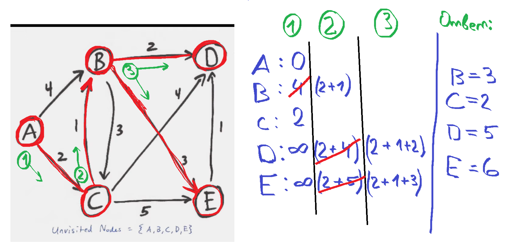

## Алгоритм Дейкстры.

**Алгоритм Дейкстры** — это алгоритм поиска кратчайших путей от одной из вершин (называемой источником) ко всем остальным вершинам во взвешенном ориентированном графе с неотрицательными весами ребер.

1) **Инициализация:** Установите начальную вершину (источник) и расстояние до всех остальных вершин как "бесконечность", за исключением начальной вершины, для которой расстояние устанавливается как 0. Текущее расстояние от источника до самого себя также устанавливается как 0.
2) **Выбор ближайшей вершины:** Начиная с источника, на каждом шаге выбирается вершина с наименьшим известным расстоянием до нее (если перебор, то O(n^2)). Это может быть сделано с использованием очереди с приоритетом, где вершины отсортированы по их текущему расстоянию (двоичная куча O(n log n)).
3) **Релаксация ребер:** Для каждой выбранной вершины пересчитывается расстояние до всех ее соседних вершин. Если новое расстояние меньше текущего, оно обновляется.
4) **Повторение:** Шаги 2 и 3 повторяются, пока все вершины не будут посещены или пока не будут найдены кратчайшие пути до всех вершин.
5) **Завершение:** По завершении работы алгоритма, расстояния до всех вершин от источника будут определены.

Этот алгоритм работает только для графов без отрицательных ребер, так как он не способен обрабатывать циклы отрицательного веса, которые могут привести к бесконечному увеличению длины пути.

> Также есть вариация Дейкстры, где вместо выбора минимальной вершины, постепенно рассматриваются все соседи каждой вершины и пересчитываются расстояния до них.
>Стартуем из источника, рассматриваем соседей, обновляем их расстояния, закидываем в очередь их соседей, продолжаем пока очередь не пуста.

